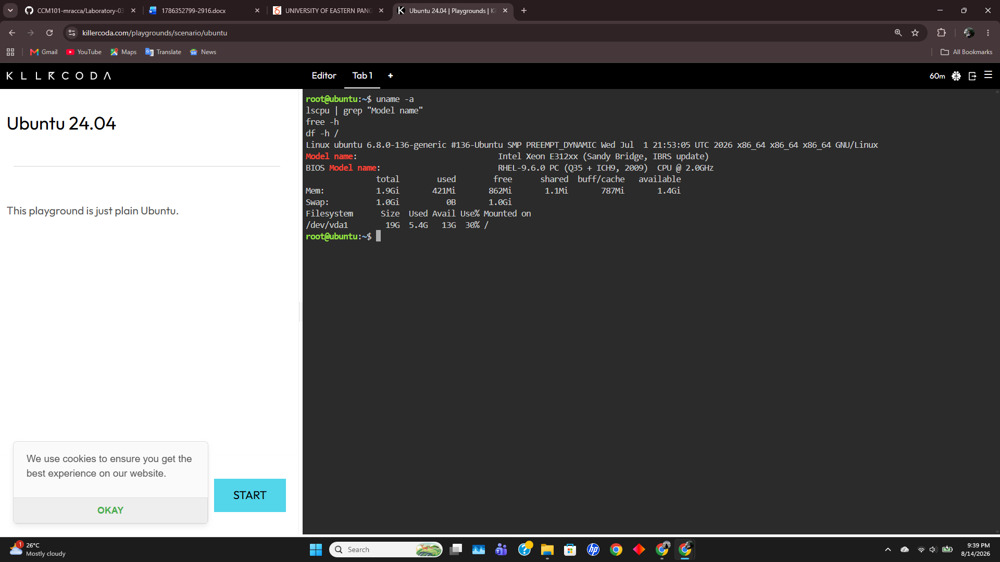

# Laboratory 03: Multi-Cloud Explorer

## Mission Overview
Explored major public cloud platforms (AWS, Azure, GCP), compared their core services, and recommended cloud solutions based on client business requirements.

---

## Linux Environment Investigation

### System Information
- **Operating System**: Ubuntu 24.04 LTS
- **CPU**: AMD EPYC 7763 64-Core Processor
- **Memory**: 3.8 GiB
- **Disk Space**: 30 GiB

### Linux Environment to Cloud Mapping
The Linux environment can be hosted using equivalent virtual machine services from the three major cloud providers:
- **AWS**: Amazon EC2
- **Azure**: Azure Virtual Machines (VM)
- **GCP**: Google Compute Engine (GCE)

### Evidence
The system information was obtained using Linux terminal commands in the KillerCoda environment.

---

## Laboratory Deliverables

- `aws-research.md` — Detailed research on Amazon Web Services core services and architecture.
- `azure-research.md` — Detailed research on Microsoft Azure core services and enterprise integration.
- `gcp-research.md` — Detailed research on Google Cloud Platform analytics, AI, and containerization.
- `cloud-platform-comparison.md` — Comparative analysis matrix, Checkpoint 5 Service Matching Table, and analysis answers.
- `client-recommendations.md` — Cloud deployment strategies and platform recommendations for target business scenarios.
- `reflection.md` — Personal reflections on multi-cloud architectures, solutions engineering, and portfolio development.
