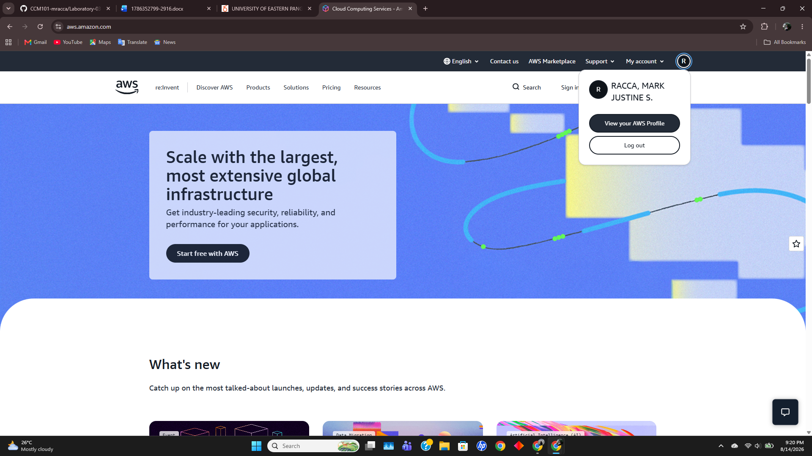

# AWS (Amazon Web Services) Research

## Overview
Amazon Web Services (AWS) is a comprehensive cloud computing platform provided by Amazon, offering over 200 fully featured services from data centers globally. Launched commercially in 2006, AWS provides scalable Infrastructure as a Service (IaaS), Platform as a Service (PaaS), and Software as a Service (SaaS) solutions for startups, enterprises, and public sector organizations.

## Screenshot

## Global Infrastructure
AWS infrastructure is structured around Regions and Availability Zones (AZs). 
- **Regions:** Geographic areas containing multiple isolated, physically separate AZs.
- **Availability Zones:** Data centers equipped with independent power, cooling, and physical security, connected via ultra-low latency networking.
- **Edge Locations:** Points of Presence (PoPs) worldwide used for content delivery (Amazon CloudFront) to reduce latency for end users.

## Cloud Management Console
The AWS Management Console is a web-based graphical interface used to manage AWS resources. It provides access to service management dashboards, cloud resource provisioning, billing monitoring, and administrative access controls.

## Core Services
1. **Amazon EC2 (Elastic Compute Cloud):** Resizable virtual servers that allow users to run application workloads on demand.
2. **Amazon S3 (Simple Storage Service):** Scalable object storage designed for online data backup, archiving, and analytics.
3. **Amazon RDS (Relational Database Service):** Managed database service supporting engine types such as MySQL, PostgreSQL, and Oracle.
4. **AWS IAM (Identity and Access Management):** Security service enabling fine-grained control over user access and API permissions across AWS resources.

## Key Advantages
- **Extensive Service Portfolio:** Offers the broadest set of mature cloud services and infrastructure features.
- **Global Reach and High Availability:** Multi-AZ deployment options provide strong application resiliency and disaster recovery options.
- **Flexible Pricing Models:** Features pay-as-you-go pricing, Reserved Instances, and Savings Plans for cost optimization.

## Typical Enterprise Use Cases
- High-traffic web and mobile application hosting requiring horizontal auto-scaling.
- Big data processing, analytics pipelines, and data lake architecture.
- Enterprise application migration and hybrid cloud infrastructure deployments.
