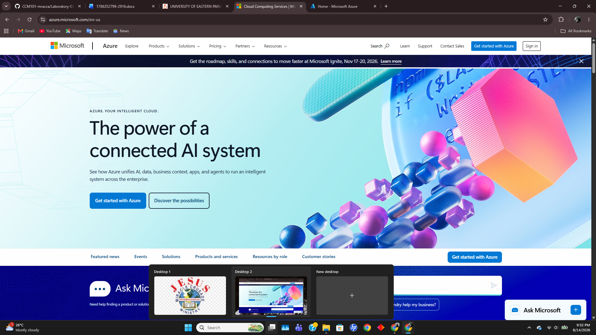

# Microsoft Azure Research

## Overview
Microsoft Azure is a public cloud computing platform developed by Microsoft. Launched in 2010, Azure provides cloud services including compute, analytics, storage, and networking. It is designed to assist organizations in managing applications through Microsoft's global infrastructure network.

## Screenshot

## Global Infrastructure
Azure features a wide geographical footprint organized into regions and availability zones.
- **Regions:** Defined geographic perimeters containing one or more data centers connected through a dedicated low-latency network.
- **Geographies:** Regional groupings designed to meet data residency, sovereignty, and compliance boundaries.
- **Availability Zones:** Unique physical locations within a region offering independent power, cooling, and networking.

## Cloud Management Console
The Azure Portal is a unified, web-based console that provides a graphical interface to build, manage, and monitor cloud resources. It integrates resource management, access control via Microsoft Entra ID, and cloud spending analytics.

## Core Services
1. **Azure Virtual Machines:** Scalable compute resources providing Linux or Windows virtual servers on demand.
2. **Azure Blob Storage:** Massively scalable object storage for unstructured data such as files, audio, video, and backups.
3. **Azure SQL Database:** Fully managed relational database engine based on the latest stable version of Microsoft SQL Server.
4. **Microsoft Entra ID (formerly Azure AD):** Identity and access management service providing single sign-on (SSO) and multi-factor authentication (MFA).

## Key Advantages
- **Seamless Microsoft Integration:** Native compatibility with Windows Server, Active Directory, SQL Server, and Microsoft 365 environments.
- **Strong Hybrid Cloud Capabilities:** Robust tools like Azure Arc for hybrid and multi-cloud management.
- **Enterprise Compliance:** Comprehensive set of compliance certifications for enterprise, healthcare, and government sector standards.

## Typical Enterprise Use Cases
- Hybrid cloud extensions for existing on-premises Active Directory and Windows infrastructure.
- Migration of legacy enterprise software built on .NET framework and SQL Server.
- Enterprise productivity integration and enterprise resource planning (ERP) hosting.
