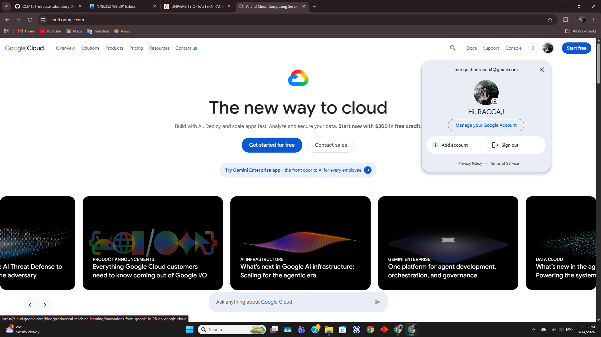

# Google Cloud Platform (GCP) Research

## Overview
Google Cloud Platform (GCP) is a suite of cloud computing services offered by Google. Launched in 2008, GCP runs on the same underlying infrastructure that Google uses internally for its end-user products, such as Google Search, YouTube, and Gmail.

## Screenshot

## Global Infrastructure
GCP is built on a global network architecture designed for speed and reliability.
- **Regions:** Independent geographic areas composed of multiple zones.
- **Zones:** Deployment areas within a region representing single failure domains.
- **Global Fiber Network:** High-bandwidth software-defined network connecting GCP locations globally.

## Cloud Management Console
The Google Cloud Console is an intuitive web-based interface for managing GCP resources. It offers centralized project management, resource telemetry, billing dashboards, and integrated Cloud Shell command-line administration.

## Core Services
1. **Google Compute Engine (GCE):** High-performance virtual machines running in Google’s data centers.
2. **Google Cloud Storage (GCS):** Unified object storage service offering high availability and variable storage classes (Standard, Nearline, Coldline, Archive).
3. **Google Kubernetes Engine (GKE):** Managed, production-ready environment for deploying containerized applications using Kubernetes.
4. **BigQuery:** Serverless, highly scalable enterprise data warehouse designed for fast SQL queries on large-scale datasets.

## Key Advantages
- **Leadership in Containers and Kubernetes:** Native expertise in container orchestration stemming from Kubernetes' origins at Google.
- **Advanced Data Analytics & AI:** Strong capabilities in data processing, BigQuery, TensorFlow, and machine learning toolsets.
- **High-Performance Global Network:** Premium tier networking utilizes Google's private global fiber network for optimized data transport.

## Typical Enterprise Use Cases
- Large-scale data analytics, data warehousing, and real-time data streaming.
- Cloud-native microservices architecture managed with Kubernetes.
- Artificial intelligence and machine learning model development and training.
